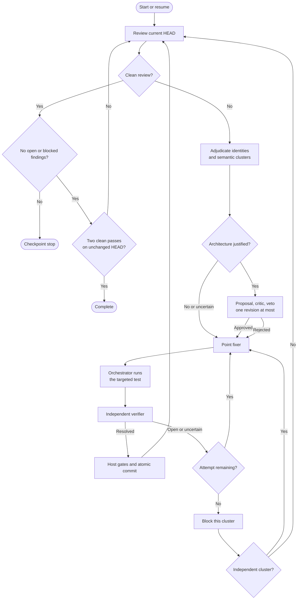

# Codex Review Loop

Codex Review Loop orchestrates native Codex reviews, semantic architecture
decisions, bounded fix attempts, and independent verification exclusively
through the locally installed Codex CLI.

## Requirements and installation

- PowerShell 7
- Git
- An installed and authenticated Codex CLI

```powershell
git clone https://github.com/InnerLive/CodexReviewLoop.git C:\Tools\CodexReviewLoop
Set-Location C:\Tools\CodexReviewLoop
pwsh -File .\codex-review-loop.ps1 -Help
```

## Usage

```powershell
pwsh -File C:\Tools\CodexReviewLoop\codex-review-loop.ps1 `
    -RepoPath C:\dev\MyProject `
    -Speed standard `
    -OutputMode compact `
    -HeartbeatSeconds 30 `
    -ColorMode Host
```

`standard` is the cost-conscious default. `fast` applies the same fast service
tier to every role, including adjudicators and resumed fixer threads. A run can
only be resumed with the same speed.

Every role runs with `--ignore-user-config`, `--ignore-rules`, and
`--dangerously-bypass-approvals-and-sandbox`. This restores the proven behavior
of the legacy unattended loop: personal configuration, approval policies,
exec rules, and Windows sandbox command classification cannot interrupt a run.
Codex CLI authentication remains available, while the loop explicitly supplies
each role's model, reasoning effort, and service tier. Repository instructions
such as `AGENTS.md` still apply.

`ConfigPath` is optional. Without it, the tool checks these locations:

1. `<repository>\.codex-review-loop.psd1`
2. `<repository>\.codex\review-loop.psd1`
3. A profile under the tool's `profiles\` directory whose `RepositoryPath`
   exactly matches the canonical Git root

If no matching profile exists, the tool creates and immediately uses the next
numbered profile prefixed with the repository name, for example
`MyProject-001.psd1`. Repositories with the same name but different paths
receive separate files such as `MyProject-001.psd1` and
`MyProject-002.psd1`. A missing explicitly requested `ConfigPath` is created
automatically as well.

The default `LogRoot = '.\runs'` is always resolved relative to the review loop
script, not the current working directory or the reviewed repository.

## How the loop works



The Reviewer emits the versioned review schema directly. Every new finding is
compared with plausible ledger candidates by Luna and Sol. Terra adjudicates
only disagreements. High-confidence `same_root_cause` results reuse the stable
finding identity even when the wording changed; independent defects in the same
file remain separate. The same durable relations form remediation clusters, so
identity and architecture decisions cannot drift apart.

Architecture is optional. Uncertain, incomplete, excessive, or rejected
architecture proposals fall back to a bounded point fix instead of stopping the
whole run. One proposal revision is allowed. Each semantic cluster has two
automatic fix attempts and its own fixer thread. Attempt two and technical
corrections resume that thread.

A fixer returns one structured targeted test:

```powershell
@{
    filePath = 'dotnet'
    arguments = @('test', '.\tests\Project.Tests.csproj', '--no-restore')
    rationale = 'Reproduces the corrected cache invalidation path.'
}
```

Any executable or repository wrapper is valid. The orchestrator resolves and
runs it, records the actual exit code and log, and supplies that evidence to the
verifier. The model cannot declare the test passed. A high-confidence resolved
verdict also needs current path-and-line evidence. Uncertainty consumes the
remaining fixer attempt; after two unsuccessful attempts only that cluster is
blocked, and independent clusters continue. Configured host gates run before
every commit.

There is no command allowlist or per-role sandbox setting. Codex may use the
repository-specific commands it needs. Fixers are allowed to edit the
worktree. Every other role receives the same command access but is bound by a
read-only role contract; the orchestrator compares the exact worktree
fingerprint before and after the role and stops if that contract is violated.

Role metadata and every durable phase transition are checkpointed atomically.
Restarting resumes a compatible active cluster in the stable v2 run location;
a read-only decision that was not yet
attached to a durable phase may be requalified. A per-repository run lock
prevents two loops from modifying the same worktree concurrently. Each run pins
the symbolic review base to its resolved commit and checkpoints an execution
fingerprint over the tool, prompts, schemas, and profile. Resume is allowed only
when repository, branch, review base, HEAD, and speed still match the
checkpoint. A changed execution fingerprint forces completed model work to be
requalified before a commit. Interrupted fixer threads and dirty worktrees are
recovered from the recorded checkpoint and streamed thread ID.
Legacy v1 checkpoints are never resumed with new orchestration code. Their
compatible findings are imported into `ledger-v2.json`, interrupted or blocked
findings are reopened, and a new stable run starts.

Targeted tests, verification roles, and host gates must leave both HEAD and the
recorded patch fingerprint unchanged. Any unexpected mutation is rejected and
is never included in a loop commit. Verification reads the current repository
directly, so large patches do not need to be copied into a prompt or split at an
arbitrary character limit.

Before publication, the loop rechecks the verified patch after staging, seals
its exact Git tree, creates a commit object from that tree, and advances `HEAD`
with an atomic old-value check. Concurrent HEAD or index changes therefore
cannot be folded into the verified commit. This plumbing-based publication does
not run porcelain commit hooks; required unattended checks belong in
`HostGates`, which run before the tree is sealed.

Host-gate executables that contain a relative path are resolved from the
reviewed repository root, not from the shell's current directory. Bare command
names continue to resolve through the environment.

Hard repository invariant failures and the configured review-cycle limit stop
at a checkpoint. Codex roles have a 45-minute process timeout; targeted tests
and host gates have a 30-minute timeout. A timeout stops the owned process tree
and follows the normal retry/checkpoint path. A commit or any other HEAD change
resets the clean-pass counter.

`AutoCommit = $true` is mandatory. The unattended loop rejects profiles that
disable it because an accepted fix must be committed before the next clean
review cycle can start.

## Live status

`compact` shows phases, roles, findings, decisions, fix attempts, verification,
targeted tests, host gates, commits, and actual role or loop failures. Internal
agent-command diagnostics, including failed exploratory commands and policy
declines, stay in the JSONL logs and do not appear in the terminal. They remain
inside the active Codex turn so the model can recover without repeating the
role. `rg` exit code 1 without output is treated as "no matches", not as a
failure. Codex
telemetry warnings, malformed auxiliary events, and incomplete event streams are
logged but do not discard an otherwise valid final result. Process failures,
`turn.failed`, timeouts, missing output, and invalid structured output reject
the role and trigger a technical retry. Once Codex has supplied a thread ID,
that retry continues the same thread instead of repeating completed work.
`balanced` adds internal agent-command starts, failures, and their short output
excerpts. `detailed` also shows successful completions and no-match searches.

Raw agent reasoning is never printed. Only role and decision summaries are
shown.

Long-running roles and host gates update one in-place status line with their
elapsed time, activity count, and last activity every 30 seconds by default.
Meaningful events continue on new lines, while `terminal.log` retains every
heartbeat. `-HeartbeatSeconds 0` disables these heartbeats.
`-ColorMode Host|Ansi|Always|Auto|Never` controls terminal colors.

Every visible status line is also written to `terminal.log` in the run directory
with a timestamp and without color codes. Codex JSONL, stderr, and host-gate logs
are flushed while the process is running. Role completion separates new input,
cached input, and output tokens so large cached context is not mistaken for
equally expensive new input.

## Help

```powershell
C:\Tools\CodexReviewLoop\codex-review-loop.ps1 -Help
```

Standard PowerShell help is available as well:

```powershell
Get-Help C:\Tools\CodexReviewLoop\codex-review-loop.ps1 -Detailed
```

## State

The repository-, branch-, and symbolic-review-base-scoped `ledger-v2.json`
persists findings across compatible runs without leaking findings between
branches. A moving base such as `main` keeps the same ledger when its commit
advances. Compatible v1 ledgers are migrated automatically.
Every run has a separate `run-v1.json` plus role-specific JSONL and result logs.
A finding is only closed after independent verification; a fix commit alone is
not enough. The latest resumable checkpoint is selected automatically unless
`-NewRun` is specified. `-NewRun` still requires a clean worktree and does not
bypass the per-repository run lock. It requalifies blocked or interrupted
findings with a fresh two-attempt budget instead of requiring manual ledger
edits.
