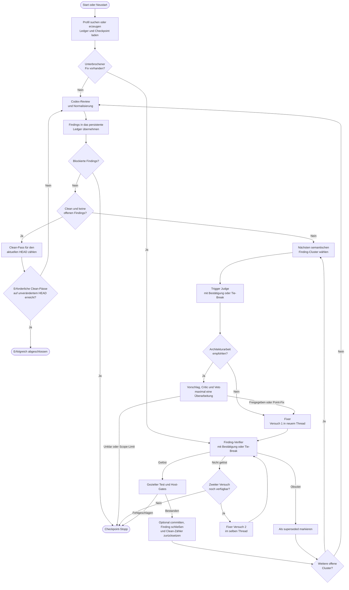

# Codex Review Loop

Die Codex Review Loop orchestriert native Codex-Reviews, semantische Architekturentscheidungen, begrenzte Fixversuche und unabhängige Verifikation ausschließlich über die lokal installierte Codex-CLI.

## Voraussetzungen und Installation

- PowerShell 7
- Git
- installierte und authentifizierte Codex-CLI

```powershell
git clone https://github.com/InnerLive/CodexReviewLoop.git C:\Tools\CodexReviewLoop
Set-Location C:\Tools\CodexReviewLoop
pwsh -File .\codex-review-loop.ps1 -Help
```

## Aufruf

```powershell
pwsh -File C:\Tools\CodexReviewLoop\codex-review-loop.ps1 `
    -RepoPath C:\dev\MeinProjekt `
    -Speed standard `
    -OutputMode compact `
    -HeartbeatSeconds 30 `
    -ColorMode Host
```

`standard` ist der kostenbewusste Default. `fast` setzt denselben Fast-Tier für jede Rolle, auch für Adjudikatoren und fortgesetzte Fixer-Threads. Ein Run wird ausschließlich mit demselben Speed fortgesetzt.

`ConfigPath` ist optional. Ohne Angabe sucht das Tool zuerst nach
`.codex-review-loop.psd1` beziehungsweise `.codex\review-loop.psd1` im
Repository und danach unter `profiles\` nach einem Profil, dessen
`RepositoryPath` exakt dem kanonischen Git-Root entspricht. Existiert noch kein
Profil, wird dort automatisch das nächste nummerierte Profil mit dem
Repositorynamen als Präfix angelegt, beispielsweise `MeinProjekt-001.psd1`.
Gleichnamige Repositories in verschiedenen
Verzeichnissen erhalten dadurch getrennte Profile wie `MeinProjekt-001.psd1`
und `MeinProjekt-002.psd1`. Ein
expliziter, noch nicht existierender `ConfigPath` wird ebenfalls automatisch
angelegt.
Der Standardwert `LogRoot = '.\runs'` wird immer relativ zum Verzeichnis des
Review-Loop-Skripts aufgelöst, nicht relativ zum aktuellen Arbeitsverzeichnis
oder zum geprüften Repository.

## Ablauf



Nach jedem Rollenwechsel wird atomar ein Checkpoint geschrieben. Ein Neustart
setzt den aktiven Cluster fort; ein Commit oder eine andere Änderung des HEAD
setzt den Clean-Zähler zurück.

## Live-Status

`compact` zeigt standardmäßig Phasen, Rollen, Findings, Entscheidungen,
Fixversuche, Verifikation, Host-Gates und Commits. Erfolgreiche interne
CLI-Befehle bleiben verborgen; Fehler erscheinen sofort mit einem kurzen
Auszug. `balanced` ergänzt kurze Aktivitätsmeldungen, `detailed` auch
Start und Abschluss erfolgreicher interner Befehle. Agent- und
Reasoning-Rohinhalte werden nie ausgegeben; ihre fachlichen Ergebnisse
erscheinen nur in den Rollen- und Entscheidungszusammenfassungen.

Länger laufende Rollen und Host-Gates melden standardmäßig alle 30 Sekunden
Laufzeit, Aktivitätszahl und letzte Aktivität. `-HeartbeatSeconds 0` deaktiviert
diese Meldung. `-ColorMode Host|Ansi|Always|Auto|Never` steuert die farbige
Terminalausgabe.

Jede sichtbare Statuszeile wird zusätzlich mit Zeitstempel und ohne Farbcodes
in `terminal.log` im Run-Verzeichnis geschrieben. Codex-JSONL, stderr und
Host-Gate-Logs wachsen bereits während des laufenden Prozesses.

## Hilfe

```powershell
C:\dev\CodexReviewLoop\codex-review-loop.ps1 -Help
```

Alternativ steht die normale PowerShell-Hilfe zur Verfügung:

```powershell
Get-Help C:\dev\CodexReviewLoop\codex-review-loop.ps1 -Detailed
```

## Zustände

Das profilweite `ledger-v1.json` hält Findings über Runs hinweg. Jeder Run besitzt ein separates `run-v1.json` und rollenbezogene JSONL-/Ergebnislogs. Ein Finding wird erst nach unabhängiger Verifikation geschlossen; ein Fix-Commit allein genügt nicht.

## Prompt-Qualifikation

```powershell
Import-Module C:\Tools\CodexReviewLoop\CodexReviewLoop.psd1 -Force
Test-CodexReviewLoopPrompts `
    -RepoPath C:\dev\MeinProjekt `
    -HistoricalLogRoot C:\ReviewLoop-Evaldaten
```

Die Qualifikation läuft immer mit Standard-Speed und Read-only-Sandbox.
Historische Logs und das angegebene Ziel-Repository werden nur gelesen.
