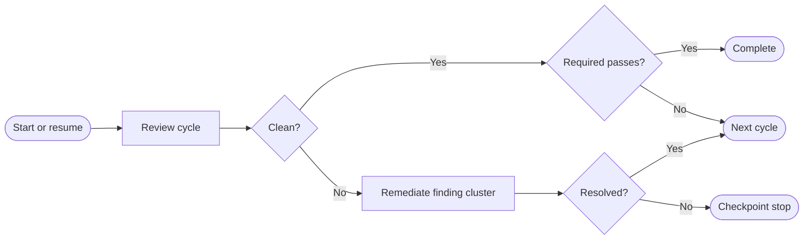

# Codex Review Loop

Codex Review Loop orchestrates native Codex reviews, semantic architecture
decisions, bounded fix attempts, and independent verification exclusively
through the locally installed Codex CLI.

## Requirements and installation

- PowerShell 7
- Git
- An installed and authenticated Codex CLI

```powershell
git clone https://github.com/InnerLive/CodexReviewLoop.git C:\Tools\CodexReviewLoop
Set-Location C:\Tools\CodexReviewLoop
pwsh -File .\codex-review-loop.ps1 -Help
```

## Usage

```powershell
pwsh -File C:\Tools\CodexReviewLoop\codex-review-loop.ps1 `
    -RepoPath C:\dev\MyProject `
    -Speed standard `
    -OutputMode compact `
    -HeartbeatSeconds 30 `
    -ColorMode Host
```

`standard` is the cost-conscious default. `fast` applies the same fast service
tier to every role, including adjudicators and resumed fixer threads. A run can
only be resumed with the same speed.

`ConfigPath` is optional. Without it, the tool checks these locations:

1. `<repository>\.codex-review-loop.psd1`
2. `<repository>\.codex\review-loop.psd1`
3. A profile under the tool's `profiles\` directory whose `RepositoryPath`
   exactly matches the canonical Git root

If no matching profile exists, the tool creates and immediately uses the next
numbered profile prefixed with the repository name, for example
`MyProject-001.psd1`. Repositories with the same name but different paths
receive separate files such as `MyProject-001.psd1` and
`MyProject-002.psd1`. A missing explicitly requested `ConfigPath` is created
automatically as well.

The default `LogRoot = '.\runs'` is always resolved relative to the review loop
script, not the current working directory or the reviewed repository.

## How the loop works



`Review cycle` means review, normalization, and ledger update. `Remediate
finding cluster` means semantic clustering, trigger and optional architecture
adjudication, at most two fix attempts, independent verification, and host
gates. A resolved cluster may be committed before continuing.

`Next cycle` returns to the review step. It is shown as an endpoint to keep the
diagram readable on GitHub instead of drawing a long backward edge.

The trigger judge may choose a point fix without invoking the architecture
roles. Architecture-positive or uncertain decisions receive independent
confirmation and, if needed, one tie-break. The same pattern is used for finding
verification. Every finding cluster gets a fresh fixer thread; only its second
attempt resumes that thread.

An atomic checkpoint is written after every role transition. Restarting resumes
the active cluster. Model disagreement, architecture scope violations, failed
host gates, exhausted fix attempts, and the review-cycle limit stop at a
checkpoint. A commit or any other HEAD change resets the clean-pass counter.

## Live status

`compact` shows phases, roles, findings, decisions, fix attempts, verification,
host gates, and commits. Successful internal CLI commands stay hidden; failures
appear immediately with a short excerpt. `balanced` adds concise activity
messages, while `detailed` also shows the start and completion of successful
internal commands.

Raw agent reasoning is never printed. Only role and decision summaries are
shown.

Long-running roles and host gates update one in-place status line with their
elapsed time, activity count, and last activity every 30 seconds by default.
Meaningful events continue on new lines, while `terminal.log` retains every
heartbeat. `-HeartbeatSeconds 0` disables these heartbeats.
`-ColorMode Host|Ansi|Always|Auto|Never` controls terminal colors.

Every visible status line is also written to `terminal.log` in the run directory
with a timestamp and without color codes. Codex JSONL, stderr, and host-gate logs
are flushed while the process is running.

## Help

```powershell
C:\Tools\CodexReviewLoop\codex-review-loop.ps1 -Help
```

Standard PowerShell help is available as well:

```powershell
Get-Help C:\Tools\CodexReviewLoop\codex-review-loop.ps1 -Detailed
```

## State

The profile-wide `ledger-v1.json` persists findings across runs. Every run has a
separate `run-v1.json` plus role-specific JSONL and result logs. A finding is
only closed after independent verification; a fix commit alone is not enough.

## Prompt qualification

```powershell
Import-Module C:\Tools\CodexReviewLoop\CodexReviewLoop.psd1 -Force
Test-CodexReviewLoopPrompts `
    -RepoPath C:\dev\MyProject `
    -HistoricalLogRoot C:\ReviewLoop-EvalData
```

Qualification always uses standard speed and a read-only sandbox. Historical
logs and the target repository are only read.
