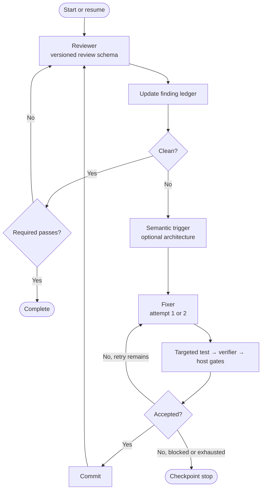

# Codex Review Loop

Codex Review Loop orchestrates native Codex reviews, semantic architecture
decisions, bounded fix attempts, and independent verification exclusively
through the locally installed Codex CLI.

## Requirements and installation

- PowerShell 7
- Git
- An installed and authenticated Codex CLI

```powershell
git clone https://github.com/InnerLive/CodexReviewLoop.git C:\Tools\CodexReviewLoop
Set-Location C:\Tools\CodexReviewLoop
pwsh -File .\codex-review-loop.ps1 -Help
```

## Usage

```powershell
pwsh -File C:\Tools\CodexReviewLoop\codex-review-loop.ps1 `
    -RepoPath C:\dev\MyProject `
    -Speed standard `
    -OutputMode compact `
    -HeartbeatSeconds 30 `
    -ColorMode Host
```

`standard` is the cost-conscious default. `fast` applies the same fast service
tier to every role, including adjudicators and resumed fixer threads. A run can
only be resumed with the same speed.

Every role runs with `--ignore-user-config`. Personal `config.toml` settings
and its MCP entries therefore cannot alter an unattended run. Codex CLI
authentication remains available, while the loop explicitly supplies each
role's model, reasoning effort, sandbox, and service tier. Repository
instructions such as `AGENTS.md` still apply.

`ConfigPath` is optional. Without it, the tool checks these locations:

1. `<repository>\.codex-review-loop.psd1`
2. `<repository>\.codex\review-loop.psd1`
3. A profile under the tool's `profiles\` directory whose `RepositoryPath`
   exactly matches the canonical Git root

If no matching profile exists, the tool creates and immediately uses the next
numbered profile prefixed with the repository name, for example
`MyProject-001.psd1`. Repositories with the same name but different paths
receive separate files such as `MyProject-001.psd1` and
`MyProject-002.psd1`. A missing explicitly requested `ConfigPath` is created
automatically as well.

The default `LogRoot = '.\runs'` is always resolved relative to the review loop
script, not the current working directory or the reviewed repository.

## How the loop works



The Reviewer emits the versioned review schema directly; there is no separate
normalization role. Remediation includes semantic clustering, trigger and
optional architecture adjudication, a hard budget of two automated fixer
attempts per cluster, an orchestrator-owned targeted test, independent
verification, configured host gates, and a commit. There is no third fixer
attempt.

The trigger judge may choose a point fix without invoking the architecture
roles. Architecture-positive or uncertain decisions receive independent
confirmation and, if needed, one tie-break. The same pattern is used for finding
verification. A direct verifier acceptance requires high confidence and an
exact command match to passing targeted-test evidence produced by the
orchestrator; otherwise Sol confirmation or Terra adjudication is required.
Configured host gates still run independently before every commit.

If a model role attempts a build, test, process-control command, unknown
executable, or repository script, the loop stops its process tree as soon as
Codex reports the command, rejects the role result, and retries within the
technical budget. A fixer edits the worktree and returns exactly one direct
targeted-test command. The orchestrator validates that command, executes it
with a bounded process lifetime, records its actual exit code and log, and
supplies that evidence to the verifier. Every finding cluster starts with a
fresh fixer thread; the second fix attempt and technical retries with a
recorded thread ID resume that same thread.

Shell activity is parsed as one literal command and matched against a small
read/edit allowlist. Unknown executables and repository scripts fail closed.
Pipelines, command chaining, redirection, nested shells, interpreters, build
tools, and model-owned test runners are rejected. Git is restricted to a small
read-only allowlist without directory or configuration overrides; all index,
ref, network, and Git worktree mutations remain orchestrator-owned. Fixers can
still edit files through the CLI's workspace-write file-editing tools.

Role metadata and every durable phase transition are checkpointed atomically.
Restarting resumes the active cluster; a read-only decision that was not yet
attached to a durable phase may be requalified. A per-repository run lock
prevents two loops from modifying the same worktree concurrently. Each run pins
the symbolic review base to its resolved commit and checkpoints an execution
fingerprint over the tool, prompts, schemas, and profile. Resume is allowed only
when repository, branch, review base, HEAD, and speed still match the
checkpoint. A changed execution fingerprint forces completed model work to be
requalified before a commit. Interrupted fixer threads and dirty worktrees are
recovered from the recorded checkpoint and streamed thread ID.

The ledger supplies the Reviewer with its existing identity catalog so recurring
findings can reuse the exact stable identity. The loop never fuzzy-merges
different findings: if path, component, cause, or invariant differs, both
records remain visible. Trigger candidates provide decision context but are
never silently added to the active architecture/fix cluster. The verifier
always receives the complete staged, unstaged, and untracked patch; patches
over 120,000 characters stop at a checkpoint instead of being partially
assessed. Targeted tests and host gates must leave both HEAD and the recorded
patch fingerprint unchanged. Any mutation blocks the cluster and is never
included in a loop commit.

Before publication, the loop rechecks the verified patch after staging, seals
its exact Git tree, creates a commit object from that tree, and advances `HEAD`
with an atomic old-value check. Concurrent HEAD or index changes therefore
cannot be folded into the verified commit. This plumbing-based publication does
not run porcelain commit hooks; required unattended checks belong in
`HostGates`, which run before the tree is sealed.

Host-gate executables that contain a relative path are resolved from the
reviewed repository root, not from the shell's current directory. Bare command
names continue to resolve through the environment.

Model disagreement, architecture scope violations, exhausted fix attempts, and
the review-cycle limit stop at a checkpoint. Codex roles have a 45-minute
process timeout; targeted tests and host gates have a 30-minute timeout. A
timeout stops the owned process tree and follows the normal retry/checkpoint
path. A commit or any other HEAD change resets the clean-pass counter.

`AutoCommit = $true` is mandatory. The unattended loop rejects profiles that
disable it because an accepted fix must be committed before the next clean
review cycle can start.

## Live status

`compact` shows phases, roles, findings, decisions, fix attempts, verification,
targeted tests, host gates, and commits. Successful internal CLI commands stay
hidden. `rg` exit code 1 without output is treated as "no matches", not as a
failure. Real command errors, Codex error events, incomplete event streams,
timeouts, missing output, and invalid structured output reject the role result
and trigger a technical retry. Once Codex has supplied a thread ID, that retry
continues the same thread instead of repeating completed work. `balanced` adds
concise activity messages, while `detailed` also shows the start and completion
of successful internal commands and no-match searches.

Raw agent reasoning is never printed. Only role and decision summaries are
shown.

Long-running roles and host gates update one in-place status line with their
elapsed time, activity count, and last activity every 30 seconds by default.
Meaningful events continue on new lines, while `terminal.log` retains every
heartbeat. `-HeartbeatSeconds 0` disables these heartbeats.
`-ColorMode Host|Ansi|Always|Auto|Never` controls terminal colors.

Every visible status line is also written to `terminal.log` in the run directory
with a timestamp and without color codes. Codex JSONL, stderr, and host-gate logs
are flushed while the process is running. Role completion separates new input,
cached input, and output tokens so large cached context is not mistaken for
equally expensive new input.

## Help

```powershell
C:\Tools\CodexReviewLoop\codex-review-loop.ps1 -Help
```

Standard PowerShell help is available as well:

```powershell
Get-Help C:\Tools\CodexReviewLoop\codex-review-loop.ps1 -Detailed
```

## State

The repository-, branch-, and review-base-scoped `ledger-v1.json` persists
findings across compatible runs without leaking findings between branches.
Every run has a separate `run-v1.json` plus role-specific JSONL and result logs.
A finding is only closed after independent verification; a fix commit alone is
not enough. The latest resumable checkpoint is selected automatically unless
`-NewRun` is specified. `-NewRun` still requires a clean worktree and does not
bypass the per-repository run lock. It requalifies blocked or interrupted
findings with a fresh two-attempt budget instead of requiring manual ledger
edits.
