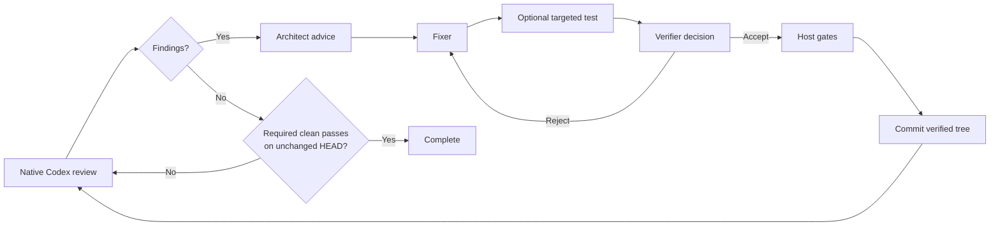

# How Codex Review Loop works

[Back to the README](../README.md)

The loop reviews and improves the complete branch diff between a pinned
`ReviewBase` commit and the current `HEAD`.

## The cycle

## 1. Native review

The Reviewer is Codex's native review function. The loop supplies the
repository and configured review base, but no custom reviewer prompt, developer
instructions, or output schema.

Codex's review text is passed unchanged to the Architect. The ledger stores a
history copy, but historical states never suppress findings from the current
native review. A clean native review advances the clean-pass counter.

## 2. Free architecture advice

The Architect receives the current review text, repository context, and up to
50 recent history entries. Its prompt describes the role and response format
without prescribing a point fix, redesign, scope, or decision criteria.

The structured Architect response is passed unchanged to the Fixer. There is no
judge, confirmation, critic, veto, or tie-break role.

## 3. Fixing without a blocked finding state

The Fixer receives the current review, the Architect response, and any feedback
from the previous Verifier call. It chooses the changes and exploratory tests.
Git determines which files actually changed.

`MaxFixAttempts` is the number of Fixer calls allowed in one review round. When
the value is reached without acceptance, the loop preserves the rejected patch
as a diagnostic artifact, restores the clean repository state, discards the
old Fixer round, and immediately starts another native review. It does not
block the finding or stop the run.

The Fixer may provide one targeted test as an executable plus argument array.
It may also report that no targeted test is available.

## 4. Direct verification

The orchestrator runs an available targeted test and records the actual result.
The Verifier receives the current repository, review text, Architect response,
Fixer response, and test evidence.

The Verifier decides directly:

- `accept = true` continues to host gates and commit.
- `accept = false` sends its feedback back to the Fixer.

There are no confidence thresholds, majority decisions, or adjudication roles.

## 5. Gates and commit

Configured `HostGates` run after acceptance and before every commit. The loop
then rechecks the patch, stages the exact verified worktree, seals that Git
tree, and advances `HEAD` only if the expected old value still matches.

The orchestrator owns authoritative tests, staging, and commits. Analysis roles
must leave the repository unchanged, and the Fixer may edit the worktree but
may not create commits or change refs.

## Completion and genuine failures

Completion requires the configured number of consecutive clean native reviews
on an unchanged `HEAD`; two is the recommended default. Every commit or other
`HEAD` change resets the clean-pass count.

There is no semantic blocked outcome. Rejected fixes, old blocked ledger
entries, and stale clean checkpoints cause another native review rather than
stopping the run.

`MaxReviewCycles` remains an explicit per-invocation token and time budget.
Every new script invocation resets that counter while retaining the checkpoint.
Reaching it returns a resumable `limit_reached` result without changing finding
status. Running the same command again therefore continues with a fresh budget.

The run may still fail when continuing would risk the repository or make the
result technically untrustworthy, for example a changed `HEAD`, an unexpected
dirty worktree, a broken Git repository, a failed Codex process lifecycle, or
an invalid structured response from a role that has a schema. These failures
preserve diagnostic state instead of claiming success or silently discarding
unknown work.
