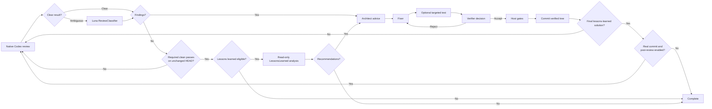

# How Codex Review Loop works

[Back to the README](../README.md)

The loop reviews and improves the complete branch diff between a pinned
`ReviewBase` commit and the current `HEAD`.

## The cycle

## 1. Native review

The Reviewer is Codex's native review function. The loop supplies the
repository and configured review base, but no positional reviewer prompt or
output schema. Optional `ReviewerInstructions` are supplied as supplemental
developer instructions without replacing the native `review --base` workflow.

The loop first recognizes established finding and clean signals locally. If
the text is ambiguous, the mechanical `ReviewClassifier` helper uses the
configured Luna model to return one boolean. It has no confidence threshold,
confirmation, tie-break, or Architect fallback. A helper failure is reported
as a technical failure.

Review text classified as containing findings is passed unchanged to the
Architect. The ledger stores a history copy, but historical states never
suppress findings from the current native review. A clean native review
advances the clean-pass counter.

## 2. Free architecture advice

The Architect receives the current findings text, repository context, and up
to 50 recent history entries. The findings text is unchanged native review
output during ordinary cycles and the complete structured analysis during the
lessons-learned phase. Its prompt describes the role and response format
without prescribing a point fix, redesign, scope, or decision criteria.

The structured Architect response is passed unchanged to the Fixer. There is no
judge, confirmation, critic, veto, or tie-break role.

## 3. Fixing without a blocked finding state

The Fixer receives the current findings, the Architect response, and any
feedback from the previous Verifier call. It chooses the changes and exploratory tests.
Git determines which files actually changed.

`MaxFixAttempts` is the number of Fixer calls allowed in one review round. When
the value is reached without acceptance, the loop preserves the rejected patch
as a diagnostic artifact, restores the clean repository state, discards the
old Fixer round, and immediately starts another native review. It does not
block the finding or stop the run.

If a Fixer process leaves partial changes before a resumable thread ID is
available, those changes are preserved and one fresh Fixer completes the same
semantic attempt. A second technical failure preserves the latest evidence,
restores the clean checkpoint, and returns to native review.

The Fixer may provide one targeted test through `targetedTest.executable` and
`targetedTest.arguments`. The executable is the program started by the
orchestrator, such as `dotnet`, `pwsh`, or a repository wrapper. Project,
script, test, and filter paths are arguments. The Fixer may also report that no
targeted test is available.

## 4. Direct verification

The orchestrator runs an available targeted test and records the actual result.
The Verifier receives the current repository, findings text, Architect
response, Fixer response, and test evidence.

The Verifier decides directly:

- `accept = true` continues to host gates and commit.
- `accept = false` sends its feedback back to the Fixer.

For an accepted patch, it also proposes the semantic commit subject, rationale,
and key changes. It does not own test claims or Git metadata.

There are no confidence thresholds, majority decisions, or adjudication roles.

## 5. Gates and commit

Configured `HostGates` run after acceptance and before every commit. The loop
then rechecks the patch, stages the exact verified worktree, seals that Git
tree, and advances `HEAD` only if the expected old value still matches.

After the gates pass, the orchestrator builds the final commit message from the
Verifier proposal and the test and gate results it directly observed. It
redacts secrets, records all findings handled by a multi-finding patch, seals
the complete message in the checkpoint, and verifies the full committed
message during crash recovery.

The orchestrator owns authoritative tests, staging, and commits. Analysis roles
must leave the repository unchanged, and the Fixer may edit the worktree but
may not create commits or change refs.

## Completion and genuine failures

Completion requires the configured number of consecutive clean native reviews
on an unchanged `HEAD`; two is the recommended default. Every commit or other
`HEAD` change resets the clean-pass count.

At that clean gate, `LessonsLearnedCommitThreshold` is reloaded. When the run
has created at least that many verified, non-empty commits and the current
`HEAD` tracks an exact root `AGENTS.md`, one read-only `LessonsLearned` call
reviews the run's commit SHAs, subjects, and diffs. Zero disables the phase.
The prompt is self-contained and does not depend on plugins, network access,
personal skills, or global Codex configuration. It may recommend concise
instructions in the applicable `AGENTS.md` or a focused repository skill under
`.agents/skills/<name>/SKILL.md`.

An empty recommendation list completes the phase without another role call.
Otherwise, each recommendation becomes a normal ledger finding and the full
analysis is passed to the Architect. Architect, Fixer, targeted test, Verifier,
host gates, and commit behavior remain unchanged. An accepted no-op solution
completes the phase without increasing the commit count. A real accepted
commit is recorded as another verified loop commit. By default, the accepted
solution is the final cycle and the run completes immediately. Setting
`ReviewAfterLessonsLearnedCommit = $true` before analysis starts instead resets
clean passes and requires native clean reviews again after a real commit.
Accepted no-op solutions always complete directly. A completed lessons-learned
phase is not repeated for the durable run.

There is no semantic blocked outcome. Rejected fixes, old blocked ledger
entries, and stale clean checkpoints cause another native review rather than
stopping the run.

`MaxReviewCycles` remains an explicit per-invocation token and time budget.
Every new script invocation resets that counter while retaining the checkpoint.
Reaching it returns a resumable `limit_reached` result without changing finding
status. Running the same command again therefore continues with a fresh budget.
The supplemental lessons-learned call is not a native review cycle and does not
consume this budget.

The run may still fail when continuing would risk the repository or make the
result technically untrustworthy, for example a changed `HEAD`, an unexpected
dirty worktree, a broken Git repository, a failed Codex process lifecycle, or
an invalid structured response from a role that has a schema. These failures
preserve diagnostic state instead of claiming success or silently discarding
unknown work.
