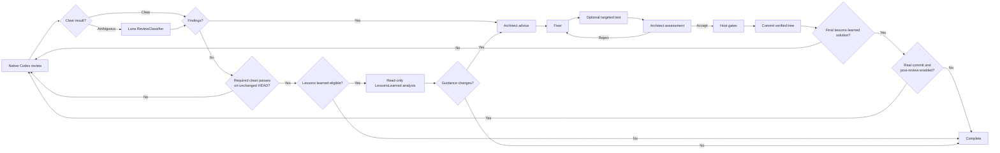

# How Codex Review Loop works

[Back to the README](../README.md)

The loop reviews and improves the complete branch diff between a pinned
`ReviewBase` commit and the current `HEAD`.

`ReviewBase = 'Auto'` resolves only when a new durable run starts. It first
uses branch-creation reflog evidence, then a unique nearest ancestor branch,
and otherwise falls back to the normal `origin/HEAD`, main/master, `HEAD^`, or
`HEAD` selection. A resumed run keeps the symbolic base and commit recorded in
its checkpoint.

## The cycle

## 1. Native review

The Reviewer is Codex's native review function. The loop supplies the
repository and configured review base, but no positional reviewer prompt or
output schema. Optional `ReviewerInstructions` are supplied as supplemental
developer instructions without replacing the native `review --base` workflow.
Every native review starts fresh; Reviewer threads are deliberately not reused.

The native Reviewer is treated as a repository transaction. Each call starts
from a clean Git checkpoint. If the Reviewer changes the active branch or
`HEAD`, the index, tracked files, or non-ignored untracked paths, the loop
silently restores that exact checkpoint before consuming the review text. A
successful review remains usable after cleanup. If exact restoration cannot be
verified, the call is not accepted and the run stops with its recovery
checkpoint intact. Other analysis roles retain their strict no-mutation
failure behavior.

The loop first recognizes established finding and clean signals locally. If
the text is ambiguous, the mechanical `ReviewClassifier` helper uses the
configured Luna model to return one boolean. It has no confidence threshold,
confirmation, tie-break, or Architect fallback. A helper failure is reported
as a technical failure.

Review text classified as containing findings is passed unchanged to the
Architect. The ledger stores a history copy, but historical states never
suppress findings from the current native review. A clean native review
advances the clean-pass counter.

## 2. Free architecture advice

The Architect receives the current findings text, repository context, and up
to 50 recent history entries. The findings text is unchanged native review
output during ordinary cycles and the complete structured analysis during the
lessons-learned phase. Its developer instructions define the role and decision
contract without prescribing a point fix, redesign, or scope.
The Architect keeps one dedicated Codex thread for the durable run, so later
cycles retain its architectural reasoning in addition to the explicit history.
The first call supplies recent ledger history. Later calls send only the new
findings and current repository context; if no Architect thread is available,
the complete bootstrap context is supplied again.

Role context has three distinct owners. Developer instructions sent on every
call define the durable role, goal, workflow, decision criteria, and ownership
boundaries. The prompt identifies the current phase and carries new evidence.
The JSON schema defines only the shape and required fields of the result. This
keeps the quality contract current even in long or compacted threads while
avoiding repeated findings, history, advice, and results.
All fixed developer-instruction, phase, and technical-recovery prompt text is
versioned as Markdown under `prompts/`; PowerShell only selects templates and
supplies dynamic values.

The structured Architect response is passed unchanged to the Fixer. After each
Fixer result, the same Architect thread assesses the resulting repository state.
There is no judge, confirmation, critic, veto, or tie-break role.

## 3. Fixing without a blocked finding state

The Fixer receives the current findings, the Architect response, and any
feedback from the previous Architect assessment. It chooses the changes and exploratory tests.
Git determines which files actually changed.
Its dedicated Codex thread is reused across attempts and finding clusters in
the same durable run.
The first call for each cluster supplies the findings and Architect advice.
Corrections in the same thread send only new feedback. A fresh recovery thread
receives the complete context again.

`MaxFixAttempts` is the number of Fixer calls allowed in one review round. When
the value is reached without acceptance, the loop preserves the rejected patch
as a diagnostic artifact, restores the clean repository state, discards the
old Fixer round, and immediately starts another native review. It does not
block the finding or stop the run.

If a Fixer process leaves partial changes before a resumable thread ID is
available, those changes are preserved and one fresh Fixer completes the same
semantic attempt. A second technical failure preserves the latest evidence,
restores the clean checkpoint, and returns to native review.

The Fixer may provide one targeted test through `targetedTest.executable` and
`targetedTest.arguments`. The executable is the program started by the
orchestrator, such as `dotnet`, `pwsh`, or a repository wrapper. Project,
script, test, and filter paths are arguments. The Fixer may also report that no
targeted test is available. The loop durably snapshots the Fixer worktree
before an available test. Repository mutations fail by default. With
`TargetedTestRepositoryChanges.Mode = 'RestoreAll'`, regular test side effects
are discarded and the exact Fixer worktree is restored before the test result
is processed. Git identity, index, and special-filesystem mutations remain
technical failures.

## 4. Architect assessment

The orchestrator runs an available targeted test and records the actual result.
The Architect inspects the current repository and receives the Fixer response
and test evidence in its existing durable thread, where the findings and
earlier advice are already available.
The advice is context, not a conformance requirement: a better Fixer deviation
may be accepted when the repository state satisfactorily resolves the findings.
Normal assessment resumes send only the Fixer and test result. Without a
durable Architect thread, recovery repeats the findings, advice, and current
repository context so the assessment remains self-contained.

The Architect decides directly:

- `accept = true` continues to host gates and commit.
- `accept = false` sends its feedback back to the Fixer.

For an accepted patch, it also proposes the semantic commit subject, rationale,
and key changes. It does not own test claims or Git metadata.

There are no confidence thresholds, majority decisions, or adjudication roles.

All other structured roles likewise retain their own independent thread for
the durable run. Threads are never shared between roles.

## 5. Gates and commit

Configured `HostGates` run after acceptance and before every commit. The loop
durably snapshots the verified worktree before each gate. The default policy
rejects any gate mutation. A gate configured with `RestoreMatching` or
`RestoreAll` may discard only regular file side effects covered by that policy;
the loop restores and fingerprints the complete pre-gate tree before
continuing. Gate changes to Git identity or special filesystem entries always
fail without cleanup. The loop then rechecks the patch, stages the exact
verified worktree, seals that Git tree, and advances `HEAD` only if the expected
old value still matches.

After the gates pass, the orchestrator builds the final commit message from the
Architect assessment proposal and the test and gate results it directly observed. It
redacts secrets, records all findings handled by a multi-finding patch, seals
the complete message in the checkpoint, and verifies the full committed
message during crash recovery.

The orchestrator owns authoritative tests, staging, and commits. Analysis roles
must leave the repository unchanged, and the Fixer may edit the worktree but
may not create commits or change refs.

## Completion and genuine failures

Completion requires the configured number of consecutive clean native reviews
on an unchanged `HEAD`; two is the recommended default. Every commit or other
`HEAD` change resets the clean-pass count.

At that clean gate, `LessonsLearnedCommitThreshold` is reloaded. When the run
has created at least that many verified, non-empty commits and the current
`HEAD` tracks an exact root `AGENTS.md`, one read-only `LessonsLearned` call
reviews a compact retrospective of the complete evidenced run. It receives
per-cycle review results, findings, Architect summaries and assessments, Fixer attempts,
resolution commits, technical-failure counts, and diff
growth alongside the verified loop commit SHAs and subjects. Raw JSONL,
stderr, internal reasoning, and prior retrospective results are excluded.
Zero disables the phase.

The analyst diagnoses why repeated work was needed, assesses the effectiveness
of existing repository guidance, and selects the smallest broadly reusable net
change. It can add, update, consolidate, or delete guidance in an applicable
`AGENTS.md` or repository skill under `.agents/skills/<name>/`. Process-only
diagnoses remain visible but do not become cross-repository work. The prompt is
self-contained and does not depend on plugins, network access, personal skills,
or global Codex configuration.

An empty `changes` list completes the phase without another role call.
Otherwise, each guidance change becomes a normal ledger finding and the full
diagnosis is passed to the Architect. Architect advice, Fixer, targeted test, assessment,
host gates, and commit behavior remain unchanged. An accepted no-op solution
completes the phase without increasing the commit count. A real accepted
commit is recorded as another verified loop commit. By default, the accepted
solution is the final cycle and the run completes immediately. Setting
`ReviewAfterLessonsLearnedCommit = $true` before analysis starts instead resets
clean passes and requires native clean reviews again after a real commit.
Accepted no-op solutions always complete directly. A completed lessons-learned
phase is not repeated for the durable run.

There is no semantic blocked outcome. Rejected fixes, old blocked ledger
entries, and stale clean checkpoints cause another native review rather than
stopping the run.

`MaxReviewCycles` remains an explicit per-invocation token and time budget.
Every new script invocation resets that counter while retaining the checkpoint.
Reaching it returns a resumable `limit_reached` result without changing finding
status. Running the same command again therefore continues with a fresh budget.
The supplemental lessons-learned call is not a native review cycle and does not
consume this budget.

The run may still fail when continuing would risk the repository or make the
result technically untrustworthy, for example a changed `HEAD`, an unexpected
dirty worktree, a broken Git repository, a failed Codex process lifecycle, or
an invalid structured response from a role that has a schema. These failures
preserve diagnostic state instead of claiming success or silently discarding
unknown work.
