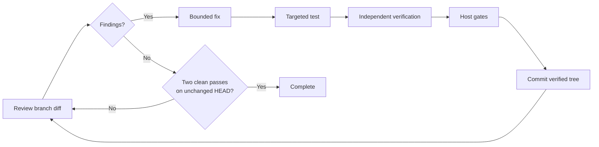

# How Codex Review Loop works

[Back to the README](../README.md)

The loop reviews and hardens the complete branch diff between a pinned
`ReviewBase` commit and the current `HEAD`. It looks for actionable correctness,
security, reliability, and material performance defects—not style-only cleanup
or optional redesigns.

## The cycle

## 1. Review and finding identity

The Reviewer inspects changed code, direct dependencies, and relevant tests.
Each finding describes a concrete violated invariant and root cause.

The ledger gives findings stable identities based on their path, component,
root cause, and invariant. A separate semantic decision determines whether a
later report is a recurrence, a related edge of the same contract, or an
independent defect. Sharing a file is not enough to combine findings.

This prevents the loop from repeatedly renaming the same defect or feeding
unrelated work into one fixer.

## 2. Optional architecture assessment

Architecture is remediation, not a required ceremony. Related history or an
explicit recurrence can trigger an assessment, but it does not force a broad
change.

The assessment compares a minimal point fix with consolidation. Consolidation
must cover the active findings, affected paths, and regression tests with lower
risk than separate fixes. An uncertain, incomplete, excessive, or rejected
proposal falls back to a point fix. Only one proposal revision is allowed.

## 3. Bounded fixing

Each semantic finding cluster receives its own fixer thread and exactly two
semantic fix attempts.

The fixer may edit the worktree and run exploratory tests, but it cannot commit.
It must return one structured targeted test as an executable plus argument
array. On the second attempt, the same fixer thread receives all supported
verification feedback together.

If both attempts fail, that cluster becomes blocked. Independent clusters
continue instead of losing otherwise useful progress.

## 4. Independent acceptance

The orchestrator—not the fixer—runs the targeted test and records its real exit
code and log. A separate verifier then checks two questions against the current
repository:

- Is the original finding resolved?
- Did the patch introduce a regression?

A fix is accepted only with a relevant passing test, high-confidence current
code evidence, a resolved original finding, and a safe patch. A changed file or
an existing commit is never enough evidence by itself.

Analysis, test, and verification roles must preserve `HEAD` and the effective
tracked and untracked patch. Content changes made by those roles stop
acceptance. The orchestrator separately owns final staging and commit.

## 5. Gates and commit

Configured `HostGates` run after verification and before every commit. The loop
then rechecks the patch, stages the exact verified worktree, seals that Git tree,
and advances `HEAD` only if the expected old value still matches.

This prevents unrelated concurrent edits, index changes, or commits from being
included in loop-owned work.

## Trustworthy completion

Completion requires exactly two consecutive clean reviews on an unchanged
`HEAD`, with no open or blocked findings. Every commit or other `HEAD` change
resets the clean-pass count.

Hard invariant failures, exhausted attempts, or the review-cycle limit produce
a durable checkpoint instead of an ambiguous success.
